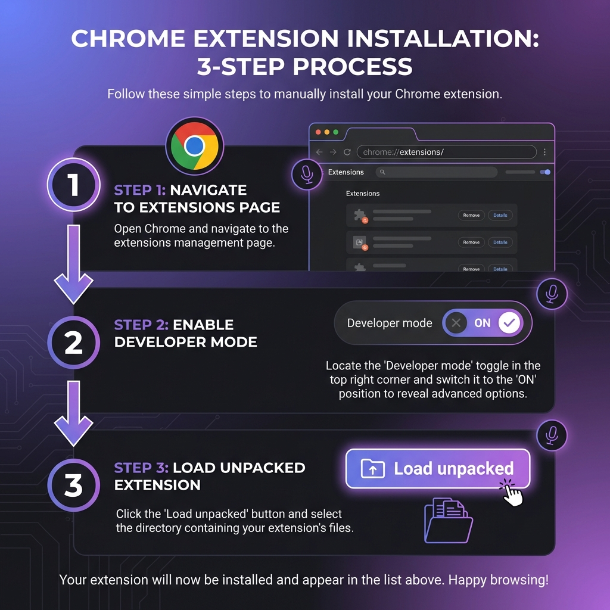

# 🚀 START HERE - Quick Setup Guide

## What is Janitor Voice?

**Janitor Voice** is a Chrome Extension that automatically speaks character messages on Janitor AI using realistic Text-to-Speech voices.

---

## ⚡ Quick Installation (Takes 2 minutes)

### Visual Guide

### Text Instructions

1. **Open Chrome Extensions**
   - Type in address bar: `chrome://extensions/`
   - Or: Menu (⋮) → More Tools → Extensions

2. **Enable Developer Mode**
   - Toggle the switch in **top-right corner**

3. **Load Extension**
   - Click **"Load unpacked"**
   - Navigate to this folder: `janitor-voice`
   - Click **"Select Folder"**

✅ **Done!** Extension is now installed.

---

## 🎯 How to Use

1. Visit **https://janitorai.com**
2. Start any character chat
3. Look for the floating panel (top-right)
4. Click **"🎤 Enable Voice"**
5. Type a message and wait for reply
6. **Character's message will be spoken automatically!**

### Keyboard Shortcut
Press `Ctrl+Shift+V` (or `Cmd+Shift+V` on Mac) to toggle voice on/off

---

## 🎛️ Customize Your Experience

The control panel lets you adjust:

- **Speech Rate**: How fast the voice speaks (0.5x to 2x)
- **Pitch**: Voice tone (0.5 to 2.0)
- **Voice**: Choose from available system voices
- **Position**: Drag the panel anywhere you want

All settings are saved automatically!

---

## 📚 More Information

- **Full Documentation**: See [README.md](README.md)
- **Troubleshooting**: See [INSTALLATION.md](INSTALLATION.md)
- **Quick Reference**: See [QUICK_REFERENCE.md](QUICK_REFERENCE.md)
- **Developers**: See [DEVELOPER_GUIDE.md](DEVELOPER_GUIDE.md)

---

## 🐛 Having Issues?

### Panel Not Showing?
- Refresh the page (F5)
- Make sure you're on janitorai.com
- Check extension is enabled in chrome://extensions/

### No Voice?
- Check system volume
- Try a different voice from the dropdown
- Make sure toggle is ON (green)

### More Help?
- Open DevTools (F12) → Console tab
- Look for messages starting with `[Janitor Voice]`
- See full troubleshooting in INSTALLATION.md

---

## ✨ Features

✅ Automatic speech for character messages  
✅ Beautiful, draggable control panel  
✅ Customizable voice, rate, and pitch  
✅ Keyboard shortcut support  
✅ No external dependencies  
✅ Privacy-focused (all local, no tracking)  
✅ Works offline (Web Speech API)

---

## 🎉 That's It!

You're ready to enjoy Janitor AI with voice!

**Questions?** Read the full [README.md](README.md)  
**Need help?** Check [INSTALLATION.md](INSTALLATION.md)

---

**Made with ❤️ for Janitor AI users** 🎤✨
